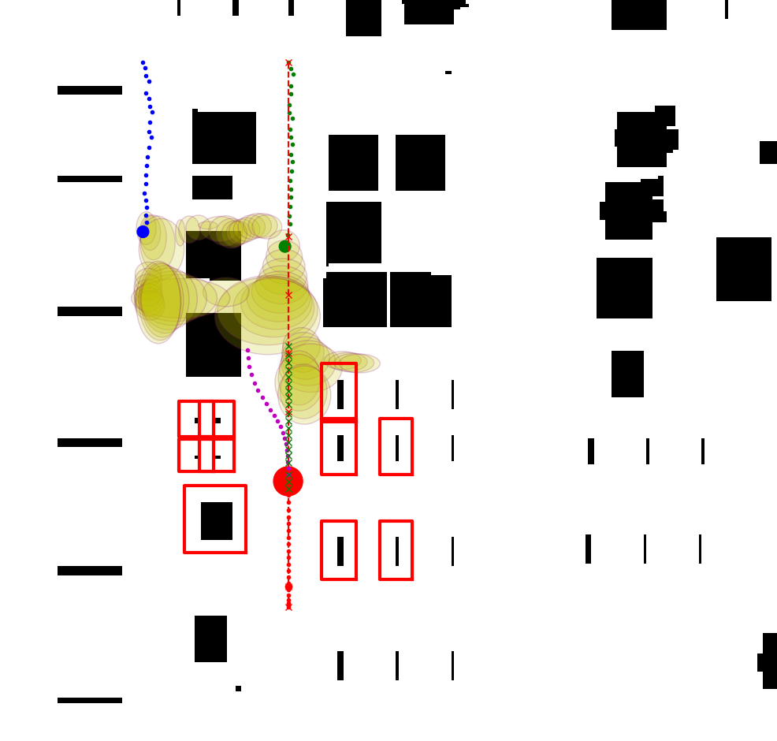

# Dynamic Obstacle Avoidance: Iterative Predition (SWTA) and Control (MPC)
To explore safer interactions between mobile robots and dynamic obstacles, this work presents a comprehensive approach to collision-free navigation in indoor environments. The proposed approach is an integration of multimodal motion predictions of dynamic obstacles and predictive control for obstacle avoidance. Motion prediction is achieved by a deep learning method that predicts plausible future positions. Model Predictive Control (MPC) solvers later generate a collision-free trajectory for the mobile robot.

## Publication
The paper is available: [Not Yet]  \
Bibtex citation:
```
not yet
```



## Quick Start
You might find "doc/interface.pdf" useful!
### OpEn
The NMPC formulation is solved using open source implementation of PANOC, namely [OpEn](https://alphaville.github.io/optimization-engine/). Follow the [installation instructions](https://alphaville.github.io/optimization-engine/docs/installation) before proceeding. 

### Install dependencies
```
pip install -r requirements.txt
```

### Generate MPC solver
Go to "solver_build.py", use the proper configuration name **cfg_fname** and run
```
python solver_build.py
```
After this, a new directory *mpc_solver* will appear and contains the solver. Then, you are good to go :)

## Use Case
Run *main.py* for the warehouse simulation (one robot, two pedestrians) in Python. The evaluation is in *main_eva.py*.

## ROS Simulation
[ROS Noetic](https://github.com/Hadi-Hajieghrary/wta_mpc_ros_Simulation)

To run the ROS simulation, download the above repository and first open a terminal to run the launch command in the ROS repo, then run the "main_ros.py" in this repo.


